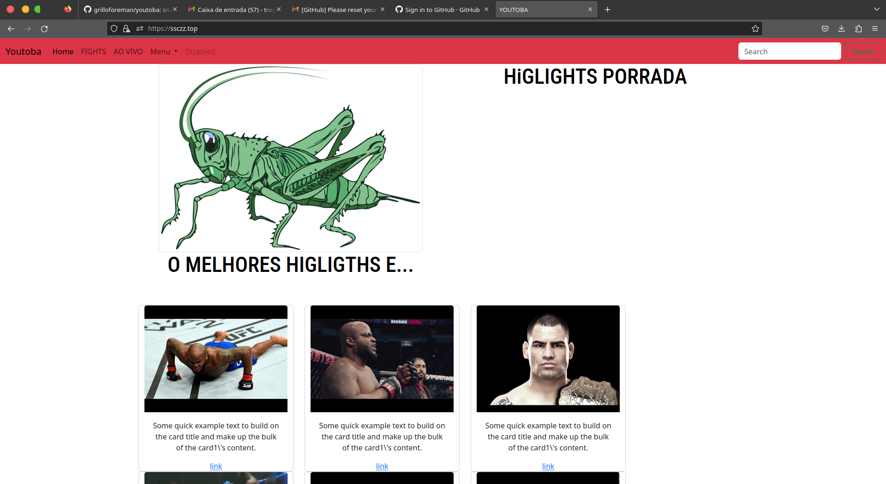

## PROJETO
O porjeto tem objetivo de entender o funcionamento de demonstrar o uso de determinadas tecnologias,
o MVC, SOLID, POO,CRUD, O RESTO TODO, DO YOUTUBE, DEPOIS TDD, DOCKER, DOCKER SDK DEPOIS talvez
API restfull, en rekacai a seguranca, cfrs, xss, lfi, rfi, csrf.

## OS sinistros usam vms os progamadores fazem na mao

Os hacker em sua origem tem distincao, os que desejam reconhecimento, os ativistas, politicos, dinheiro.
O cenario que vejo que muitos nao sabem fazer o proprio cenario, o que aconetece que saibam pouco
sobre o que fazem, muito conceitos na programcao foram desenvolvidos o que faz que sabe fazer rodar
o algum scan é muito pouco
